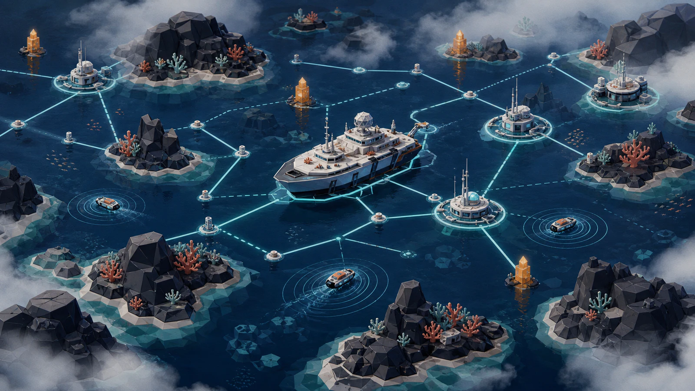
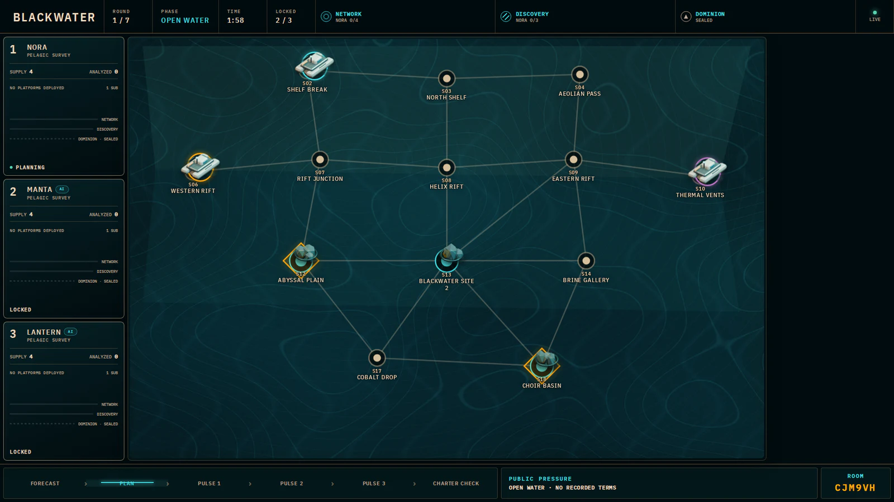
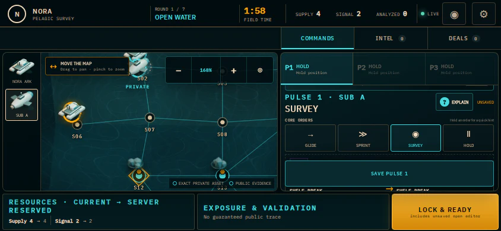

<p align="center">
  
</p>

<h1 align="center">Blackwater</h1>

<p align="center"><strong>Build the map. Sell the truth. Reach the deep first.</strong></p>

<p align="center">
  A 1–6 player couch strategy game where the TV holds public truth<br />
  and every phone hides a submarine expedition.
</p>

Blackwater compresses the alliances, brinkmanship, and persistent board state of
a long strategy game into a 25–35 minute game night. Program three simultaneous
orders, trade real resources, sell reports that may be false, and stop a leader
without knocking anyone out. Solo and mixed groups can fill empty seats with AI.

<table>
  <tr>
    <td width="66%"></td>
    <td width="34%"></td>
  </tr>
  <tr>
    <td align="center"><sub>Shared map, public pressure, known victory Charters</sub></td>
    <td align="center"><sub>Private routes, intel, deals, and programmed Pulses</sub></td>
  </tr>
</table>

## Start a game

You need Docker, a laptop on the same Wi-Fi as the phones, and its LAN IP.

```bash
git clone https://github.com/ralfboltshauser/blackwater.git
cd blackwater
cp .env.example .env
# Set BLACKWATER_LAN_URL to this computer's LAN address, then:
docker compose up --build
```

Open `http://localhost:8787/host`, create an expedition, and put the public
display on the TV. Friends scan its QR code; no accounts or internet service are
required. The host can run the built-in briefing before round one.

> Plain HTTP is perfect for browser play on trusted Wi-Fi. Installing the phone
> controller as a fullscreen PWA requires an HTTPS hostname and certificate.

## How it plays

- **Program:** secretly queue three orders across your two submarines.
- **Negotiate:** make binding trades, breakable handshakes, and risky intel sales.
- **Resolve:** everyone moves together; traps and interference are deterministic.
- **Win:** complete a public Network, Discovery, or Dominion Charter—possibly in
  round one, possibly alongside another winner.

The UI teaches systems progressively. Start with movement and surveying; tactical
orders, deals, and deeper intel unlock as the expedition develops. Read the
[table rules](RULEBOOK.md) or the [architecture guide](ARCHITECTURE.md) when you
want the full detail.

## Develop

Requires Node 24–26 and pnpm 11.

```bash
pnpm install --frozen-lockfile
pnpm dev          # app + realtime server
pnpm check        # format, types, tests, production build, PWA verification
pnpm test:e2e     # complete browser game-night flows
```

The deterministic rules engine lives in `packages/game-core`; Fastify,
Socket.IO, and SQLite provide the authoritative runtime; React renders separate
host, TV, and private-player projections. See [GAME_DESIGN.md](GAME_DESIGN.md)
for the design intent.

<sub>Concept artwork was AI-generated; the gameplay screenshots are from the running game.</sub>
